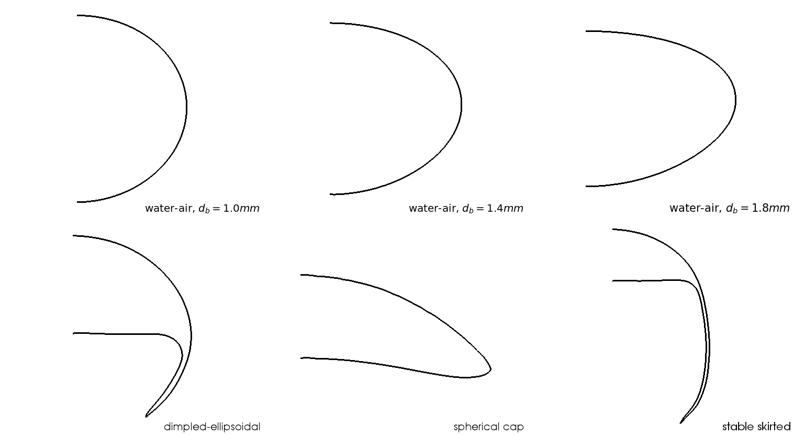

# OpenFOAM utilities and solvers

This repository contains [OpenFOAM](https://openfoam.com/) test cases, boundary conditions, utilities and solvers related to the PhD thesis entitled

> Modeling and simulation of convection-dominated species transfer at rising bubbles

This project was funded by the German Reseach Foundation (DFG) within the priority program [SPP1740 Reactive Bubbly Flows](http://www.dfg-spp1740.de/) under the grand *BO 1879/13-2*. The work was supervised by [Prof. Dr. rer. nat. Dieter Bothe](mailto:bothe@mma.tu-darmstadt.de) and conducted at the [Institute for Mathematical Modeling and Analysis](https://www.mma.tu-darmstadt.de/index/index.en.jsp) at the Technical University of Darmstadt.

## Dependencies

All boundary conditions, utilities, and solvers are compiled using a special Docker image containing:

- OpenFOAM-v1906
- [PyTorch](https://pytorch.org/) 1.2.0

The Dockerfile and additional information on the build process can be found [here](https://github.com/AndreWeiner/of_pytorch_docker). The docker image is hosted on [Dockerhub](https://cloud.docker.com/u/andreweiner/repository/docker/andreweiner/of_pytorch). To pull the image containing OpenFOAM-v1906 and PyTorch 1.2, run

```
docker pull andreweiner/of_pytorch:of1906-py1.2-cpu
```

### Docker

Any installed version of [Docker](https://docs.docker.com/install/) larger than **1.10** will be able to pull and execute the Docker image hosted on [Dockerhub](https://hub.docker.com/r/andreweiner/jupyter-environment). There are convenience scripts to create and start a Docker container which require root privileges. To avoid running the scripts with *sudo*, follow the [post-installation steps](https://docs.docker.com/install/linux/linux-postinstall/).

### PyTorch models

The folder *test_cases/pyTorchModels/* contains trained models in [torch script](https://pytorch.org/docs/stable/jit.html) format. The worklow to create such models is available in a [dedicated repository](https://github.com/AndreWeiner/phd_notebooks). Models starting with **water_** or **bhaga_** provide values for the tangential velocity at the bubble surface of the corresponding case. The models are used in the boundary conditions contained in the directory *boundary_conditions*. All other models are used by subgrid-scale models for various reactive species boundary layers. The model name follows the structure **field**\_model\_**reactionType**\_ts.pt. For example, the model *A_model_decay_ts.pt* is used to correct the fluxes of the transfer species *A* in a *decay* reaction. The following prototype reactions have been tested:

* physisorption (no reaction)
* decay reaction: $A\rightarrow P$
* single reaction: $A + B \rightarrow P$
* parallel-consecutive reaction: $A + B \rightarrow P$ and $A + P \rightarrow S$

where the educts and products are:

* *A* - transfer species (the dissolved gas)
* *B* - bulk species (some educt dissolved in the liquid phase)
* *P* - the primary product (maybe wanted)
* *S* - a side product (maybe unwanted)

### Geometry files

Geometry files in STL format are located in the *test_cases/geometries/*  folder. Currently, there are six different shapes available. A preview is provided below. Note that the shapes have a depth to be used by *snappyHexMesh* (not visible in the preview).



## Compiling solvers, utilities, and boundary conditions

There are two scripts to create and start a Docker container with suitable settings. The script *createContainer.sh* has to be run **only once** on a fresh system. The script *startContainer.sh* will present you with a new shell prompt in which solvers etc. can be compiled and executed. The latter script needs to be run whenever you start a new terminal (to compile or run simulations). If you want to learn more about what happens in the background, refer to [this blog post](http://myheutagogy.com/2019/06/04/a-detailed-look-at-the-openfoam-plus-docker-workflow/).

To compile OpenFOAM related source code, the following steps are required:

1. start/enter the Docker container
2. source the OpenFOAM environment variables
3. navigate to the location containing the source code
4. compile

For example, to compile the velocity boundary condition for simple shapes run (from the top level folder of the repository):

```
# executables will be stored in the bin folder
mkdir bin
./startContainer
# now we are operating from within the container
source /opt/OpenFOAM/OpenFOAM-v1906/etc/bashrc
cd boundary_conditions/bubbleSurfaceVelocitySimple/
wmake
```
The following applications are available:

* **bubbleSurfaceVelocitySimple**: velocity boundary condition for simple (star-shaped) shapes.
* **bubbleSurfaceVelocityComplex**: velocity boundary condition for dimpled ellipsoidal and skirted bubbles (with inner and outer contour).
* **speciesFoam**: solves simple convection-diffusion-reaction equations on a given velocity field.
* **sgsSpeciesFoam**: solves simple convection-diffusion-reaction equations with subgrid-scale modeling on a given velocity field.
* **localReactiveData**: extracts species-related interfacial data (e.g. to compute the local Sherwood number).
* **extractTrainingData**: extracts training data based on which machine learning models are created (in another step).
* **bubbleSurfaceFields**: extracts interfacial quantities related to velocity and pressure.

## Running test cases

Running test cases follows a similar procedure as compiling applications. There are some scripts in the directory *test_cases* which automate certain steps. For example, the script *createMeshes.sh* creates a run directory, copies the *snappyHexMesh* folders, and initiates the meshing process for all geometries. The *test_cases/run/* folder is not tracked by *git* to separate simulation results from version-controlled files. To run any test case, I recommend the following steps (all test cases provide *Allrun* scripts):

```
./startContainer
# now we are operating from within the container
source /opt/OpenFOAM/OpenFOAM-v1906/etc/bashrc
cd test_cases
mkdir -p run
cd run
cp -r ../path_to_test_case/test_case .
cd test_case
./Allrun
```

Note that there are dependencies between the various test cases. For example, running a species transport simulation with *speciesFoam* requires a mesh and a velocity field. So the order to execute the provided simulation settings would be *meshing*, *flow solution*, *species transport*. Check out the *Allrun* scripts for more information.

The naming convention for the test cases in relation to the geometry files presented before is as follows:

* water-air, d_b=1.0mm: all cases in *water_01_l16*
* water-air, d_b=1.4mm: all cases in *water_03_l16*
* water-air, d_b=1.8mm: all cases in *water_05_l16*
* dimpled ellipsoidal: all cases in *bhaga_02_l16*
* spherical cap: all cases in *bhaga_03_l16*
* stable skirted: all cases in *bhaga_04_l16*

The *bhaga_* test cases are based on experimental investigations by **Bhaga and Weber**. For more information on material parameters in terms of dimensionless numbers, refer to table 6 in section 6.1 of my thesis and to the following article:

```
D. Bhaga and M. E. Weber. Bubbles in viscous liquids: shapes, wakes and velocities. In: Journal of Fluid Mechanics 105 (1981), pp. 61–85. DOI : 10.1017/S002211208100311X.
```

The numbers in the names of the test cases have no particular meaning. The first double digit number is simply a running index. For example, bhaga_01_* was originally among the test cases, but violated the assumption of symmetry around the rise direction. The last number indicates the maximum refinement in the two-phase Basilisk simulations. All the geometry files used here stem from simulations with a refinement level of 16. The value 16 has no absolute meaning but is just relative to the initial grid. Refer to section 3.1 and 6 in my [thesis](https://tuprints.ulb.tu-darmstadt.de/cgi/users/home?screen=EPrint%3A%3AView&eprintid=11405) for more information.

Let's say we wanted to simulate physisorption from a d_eq=1.8mm bubble rising in water (case *water_05_l16*). To perform this species transport simulation, we need a mesh, a flow field (flux field), and the case computing the species transport of a single species (say A). Before starting the simulations, solvers, utilities, and boundary conditions have to be compiled. Then, executing the following commands creates and runs the simulation outlined before:

```
# start container
./startContainer
# now we are operating from within the container
source /opt/OpenFOAM/OpenFOAM-v1906/etc/bashrc
cd test_cases
mkdir -p run
cd run
# copy the case files for meshing, flow dynamics, and species transport
# we will perform simulations on the coarsest refinement level (0)
cp -r ../snappyHexMesh/water_05_l16/refinement_0/ .
cp -r ../simpleFoam/water_05_l16/hydro_steady_0/ .
cp -r ../speciesFoam/water_05_l16/phys_pe50k_0/ .
./refinement_0/Allrun
./hydro_steady/Allrun
./phys_pe50k_0/Allrun
# optional: extract local and global Sherwood number
cd phys_pe50k_0
/home/bin/localReactiveData &> log.localReactiveData
```
The flow dynamics simulations on finer meshes mostly use results from the previous refinement level to initialize the flow field. For example, executing *hydro_steady_1* requires the execution if *refinement_0*, *refinement_1*, and *hydro_steady_0*. To avoid this behavior, simply uncomment the field mapping in the *Allrun* script.

## How is this repository related to my thesis

The OpenFOAM-related test cases in this repository have direct dependencies to the [Jupyter-repository](https://github.com/AndreWeiner/phd_notebooks) and indirect dependencies (via the Jupyter repository) to the [Basilisk repository](https://github.com/AndreWeiner/phd_basilisk).

### Data required by this repository

- STL files to create the single phase meshes for various shapes
- PyTorch-based velocity boundary condition at the bubble surface (boundary)
- PyTorch-based subgrid-scale models to perform simulations with *sgsSpeciesFoam*

### Data provided by this repository

All of the test cases in *simpleFoam*, *speciesFoam*, and *sgsSpeciesFoam* contribute to the results presented in chapter 6 of my thesis. Sometimes it's a picture of an unstructured mesh, a velocity field, or a concentration field, and sometimes it's a single number, e.g., the global Sherwood number. The following list provides more details:

- the single-phase velocity fields visualized in figures 64 to 68 of chapter 6 were extracted from simulation results on the finest meshes (*refinement_3*) using Paraview as described in [this notebook](https://github.com/AndreWeiner/phd_notebooks/blob/master/notebooks/basilisk_2D_velocity_field.ipynb); the resulting CSV files were then copied to the Jupyter repository
- the concentration fields in figures 69 to 78 were created directly in Paraview and show the results obtained on the finest meshes
- the local and global Sherwood numbers in sections 6.6 and 6.7 were extracted from the simulations using the *localReactiveData* utility; the utility saves local Sherwood numbers in each time folder and the global Sherwood number in the top-level folder of the simulation; the resulting CSV files were copied to the Jupyter-repository and then evaluated and visualized
- the test cases in *./test_cases/data_generation/* were used to generate the training data for the data-driven subgrid-scale models

## How to reference

This repository accompanies the following thesis:
```
@phdthesis{tuprints11405,
            year = {2020},
         address = {Darmstadt},
          school = {Technical University of Darmstadt, Mathematical Modeling and Analysis},
          author = {Andre Weiner},
           title = {Modeling and simulation of convection-dominated species transfer at rising bubbles},
           month = {February},
            url = {http://tuprints.ulb.tu-darmstadt.de/11405/}
}
```
